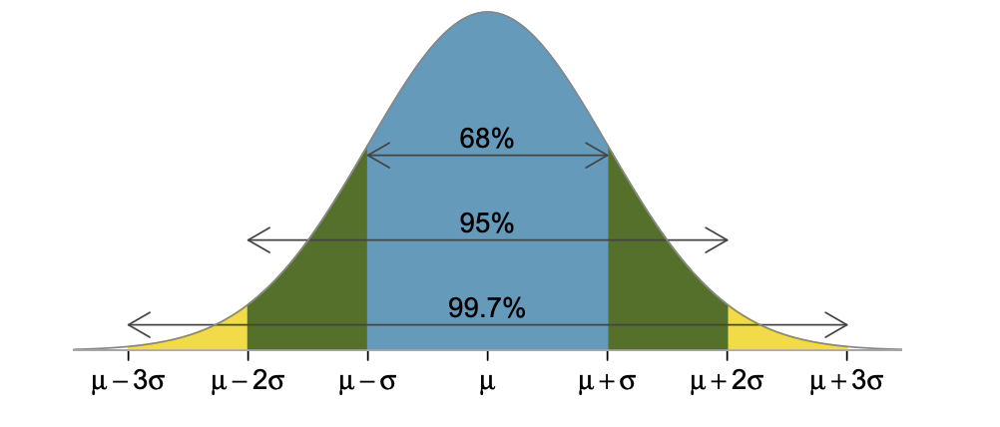

# Статистические методы поиска выбросов

## Понятие выброса
Одним из этапов очистки данных является поиск выбросов

**Выброс (аномалия)** - это наблюдение, которое существенно выбивается из общего распределения и сильно отличается от других данных.

В данном разделе рассматриваются статистические методы поиска выбросов, а именно:
* Метод межквартильного размаха
* Метод z-отклонений (метод сигм)

## Метод межквартильного размаха


### **Алгоритм метода:**

1. Вычислить 25-й и 75-й процентили (1-й и 3-й квартили) - $Q_{25}$ и $Q_{75}$ для признака, который мы исследуем
2. Вычислить межквартильный размах:
    * $IQR=Q_{75}-Q_{25}$
3. Определить верхнюю и нижнюю границы Тьюки:
    * $bound_{upper}=Q_{75}+1,5*IQR$
    * $bound_{lower}=Q_{25}-1,5*IQR$
4. Найти наблюдения, которые выходят за эти границы

### **Недостатки метода:**

Метод требует, чтобы признак, на основе которого происходит поиск выбросов, был распределён нормально.

### **Модификация метода:**

Можно попробовать воспользоваться методами преобразования данных, например, логарифмированием, чтобы свести распределение к нормальному или хотя бы к симметричному.

Кроме того, можно изменить количество межквартильных размахов, которые откладываются влево и вправо для поиска границ распределения.

## Метод z-отклонений (метод сигм)

Правило трёх сигм гласит: если распределение случайной величины является нормальным, то 99,73% наблюдений лежат в интервале $(\mu-3\sigma$; $\mu+3\sigma)$, где
* $\mu$ - математическое ожидание (для большой выборки можно считать равным среднему значению)
* $\sigma$ - стандартное (среднее квадратическое) отклонение

Наблюдения, которые лежат за пределами этого интервала, будут считаться выбросами.



### **Алгоритм метода:**

1. Вычислить среднее значение $\mu$ и стандартное отклонение $\sigma$ для признака, который мы исследуем
2. Определить верхнюю и нижнюю границы:
    * $bound_{upper}=\mu+3*\sigma$
    * $bound_{lower}=\mu-3*\sigma$
3. Найти наблюдения, которые выходят за эти границы

### **Недостатки метода:**

Метод требует, чтобы признак, на основе которого происходит поиск выбросов, был распределён нормально.

### **Модификация метода:**

Можно попробовать воспользоваться методами преобразования данных, например, логарифмированием, чтобы свести распределение к нормальному или хотя бы к симметричному.

Кроме того, можно изменить количество стандартных отклонений, которые откладываются влево и вправо для поиска границ распределения.

## Реализация методов

Методы реализованы в виде функций find_outliers_iqr() и find_outliers_z_score(). Функции представлены в файле find_outliers.py. К функциям предоставлена документация.

## Примеры использования

Обязательными аргументами функций, реализующих методы поиска выбросов, являются:
* data (pandas.DataFrame): набор данных (таблица)
* feature (str): имя признака, на основе которого происходит поиск выбросов

Использование классических подходов без модификаций:
```python
# Метод межквартильного размаха:
from outliers_lib.find_outliers import find_outliers_iqr

outliers_iqr, cleaned_iqr = find_outliers_iqr(data, feature)

# Метод z-отклонений:
from outliers_lib.find_outliers import find_outliers_z_score

outliers_z_score, cleaned_z_score = find_outliers_z_score(data, feature)
```
Использование методов с предварительным логарифмированием:
```python
outliers_iqr, cleaned_iqr = find_outliers_iqr(data, feature, log_scale=True)
outliers_z_score, cleaned_z_score = find_outliers_z_score(data, feature, log_scale=True)
```
Использование методов с предварительным логарифмироанием и нестандартными границами допустимого разброса:
```python
outliers_iqr, cleaned_iqr = find_outliers_iqr(data, feature, log_scale=True, left=2, right=2)
outliers_z_score, cleaned_z_score = find_outliers_z_score(data, feature, log_scale=True, left=2, right=2)
```

## Использованные инструменты и библиотеки:
* numpy (1.24.2)
* pandas (1.5.3)

## Дополнительные источники:
* [Нормальное распределение](https://ru.wikipedia.org/wiki/Нормальное_распределение)
* [Метод межквартильного размаха](https://recture.ru/common/chto-takoe-pravilo-mezhkvartilnogo-razmaha/)
* [Правило трёх сигм](https://wiki.loginom.ru/articles/3-sigma-rule.html)